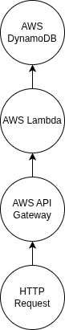

# Minesweeper

## Overview

This repository implements a simplified version of the **Minesweeper** video game, written in the **C programming language**. It utilizes the [GTK library](https://www.gtk.org/) to create the GUI and a series of **AWS services** to store the high score.

An HTTP request sends the high score through a route configured with **AWS API Gateway** to a **Lambda Function**, which inserts the high score into — or retrieves the high score from — the **DynamoDB table**.
